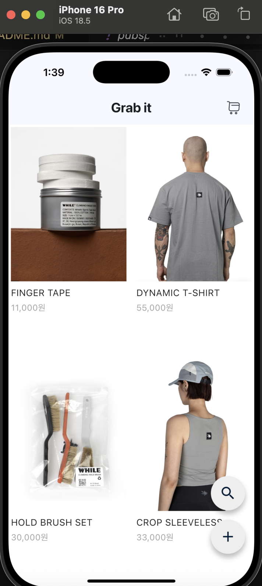
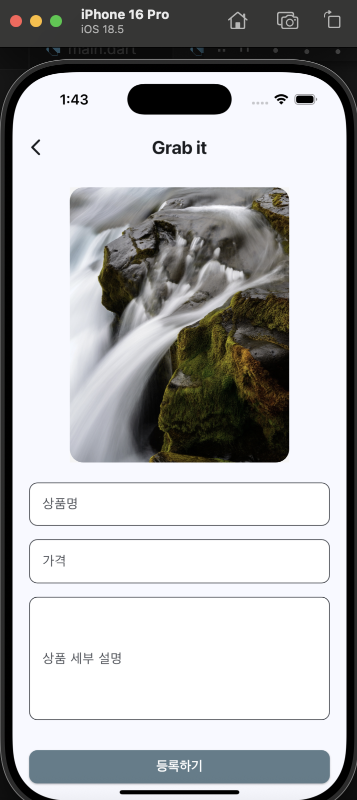
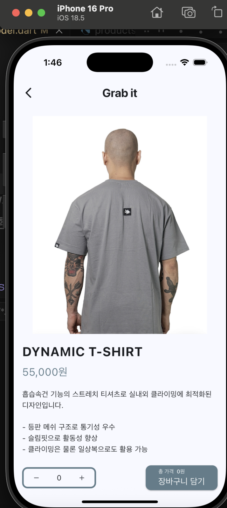
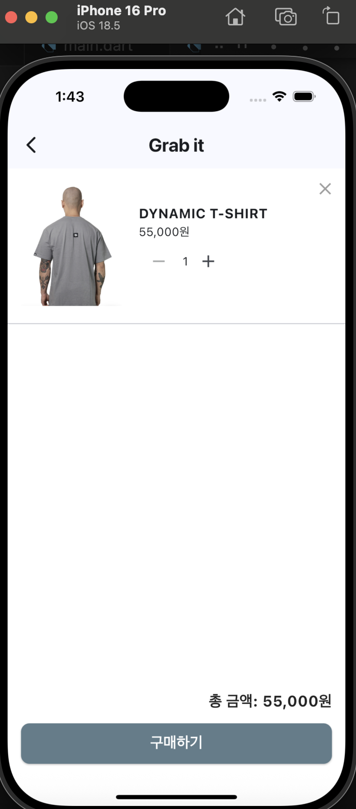

# 🛒 Grab it - 클라이밍 쇼핑몰 (Flutter 기초 쇼핑몰 프로젝트)

이 프로젝트는 클라이밍 쇼핑몰과 제공해주신 기초 프로젝트 기능을 바탕으로, 상품 등록 → 목록 → 상세 보기 → 장바구니 담기까지의 **앱 흐름을 직접 구현하였습니다**

---

## 📁 폴더 구조

```
lib/
├── main.dart
├── product_model.dart
├── screen/
│   ├── product_list_page.dart
│   ├── product_add_page.dart
│   ├── product_detail_page.dart
│   └── cart_page.dart
├── widget/
│   ├── register_field.dart
│   ├── image_field.dart
│   ├── product_search_delegate.dart
│   ├── prduct_description_widget.dart
│   ├── cart_item_tile.dart
│   └── number_button.dart
```

---

## 🧭 전체 기능 흐름 요약

1. `ProductListPage`: 홈 - 상품 목록 확인

   

2. `ProductAddPage`: 상품 등록 (FAB 버튼)

   

3. `ProductDetailPage`: 상품 상세 및 수량 선택

   

4. `CartPage`: 장바구니 관리

   

---

## 📌 주요 페이지 설명

### 1. `main.dart`

- 앱 시작점
- 라우팅 설정 및 기본 화면 지정

---

### 2. `ProductListPage`

- `GridView.count`로 상품 2열 나열
- FAB 클릭 → 상품 등록 페이지 이동
- AppBar에 검색 기능 포함

➡️ `ProductList().products` 싱글톤 데이터 사용

---

### 3. `ProductAddPage`

- 상품명, 가격, 설명, 이미지 등록 폼
- `register_field.dart`로 각각의 입력 필드를 위젯으로 분리
- 이미지 선택은 `image_field.dart` 사용
- 유효성 검사 → 등록 → 다이얼로그 → pop()

---

### 4. `ProductDetailPage`

- 선택된 상품 정보 출력
- `number_button.dart`로 수량 조절
- 수량이 1 이상이면 장바구니 추가 가능
- 이미 존재하는 상품이면 수량만 증가

---

### 5. `CartPage`

- `ListView.builder`로 장바구니 리스트 출력
- 각 항목은 `cart_item_tile.dart`에서 렌더링
- 수량 조절 및 삭제 가능
- 총 금액 표시 및 구매 버튼 포함 (구현 X)

---

## 🧱 데이터 모델 구조

### Product

```dart
class Product {
  final String name;
  final int price;
  final String imageUrl;
  final String description;
}
```

### ProductList (싱글톤)

```dart
class ProductList {
  final List<Product> products = [];
  static final ProductList _instance = ProductList._internal();
  factory ProductList() => _instance;
}
```

### Cart & CartItem

```dart
class CartItem {
  final Product product;
  int number;
}

class Cart {
  final List<CartItem> items = [];
  // addItem(), removeItem() 등의 메서드 포함
}
```

---

## 🔧 재사용 위젯 설명

| 위젯 파일                      | 역할                               |
| ------------------------------ | ---------------------------------- |
| `register_field.dart`          | 이름, 가격, 설명 입력 위젯         |
| `image_field.dart`             | 이미지 선택 후 미리보기            |
| `product_search_delegate.dart` | 상품명 기반 검색 구현              |
| `number_button.dart`           | 수량 + / - 조절 버튼               |
| `cart_item_tile.dart`          | 장바구니 내 상품 정보 카드 형태 UI |

---

## ✅ 마무리

- 이 프로젝트는 Flutter에서 기본적인 **페이지 이동**, **입력 처리**, **데이터 공유(Singleton)**, **간단한 UI 구성(Grid/List)**을 이해하는 데 초점을 맞춘 학습용 과제입니다.
- 구조는 단순하지만, 위젯별로 나누어져 있어 확장성과 유지보수 측면을 고려했습니다.

---
